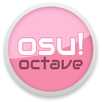

<h1 align="center">
  <a href="https://gl33ntwine.com/p/osu-octave/"></a>
  <br>
  osu!octave
</h1>

<h4 align="center">Open-Source, Usable Osu! Client.<br>Tailored and Adjusted for the Vita and Embedded</h4>

<p align="center">
  <a href="https://github.com/v-atamanenko/osu-octave/releases/latest">
    
  </a>
  <a href="https://discord.gg/PyCaBx9"></a>
  <a href="https://paypal.me/atamanenkoGE">
    
  </a>
</p>

<p align="center">
  <a href="#what-is-this">What is this</a> •
  <a href="#compatibility">Compatibility</a> •
  <a href="#how-to-use">How to use</a> •
  <a href="#credits">Credits</a> •
  <a href="#license">License</a>
</p>

## What is this
**osu!octave** is a free and open source rhythm game designed to play *osu!standard* beatmaps, optimized for best
performance and playability on PlayStation Vita.

Its core (as in, the very base of hit objects logic and some parts of architecture) is based on
[osu-ds](https://github.com/echojc/osu-ds), an unfinished osu! port to Nintendo DS made by Echo in 2009 and released
under the BSD-2 license.

**DISCLAIMER:** osu!octave is not affiliated, associated, authorized, endorsed by, or in any way officially connected
with ppy Pty Ltd, peppy, osu! or any of its subsidiaries or its affiliates. Please do not contact these people and
organizations with any questions regarding osu!octave.

## Compatibility
### Platforms to run on
By design, osu!octave is a PlayStation Vita osu! client. However, considering that it only depends on **C++17** and
**SDL2**, it's totally possible to run it on any platform that can provide these two things and has 350MB+ of RAM and
a 500MHz+, 2 core+ CPU.

The main obstacle to running osu!octave on Windows, Linux, or, for instance, Android is the limited flexibility of
the current CMakeLists file and not-really-adaptive coordinate system.

If you're interested in porting osu!octave to a new platform, Pull Requests are very much appreciated! I promise to
provide you with any help I can in the process.

### Beatmaps compatibility
osu!octave should play any osu!standard beatmap, very closely to original. If you experience issues with a particular
beatmap, please do [create a new Issue](https://github.com/v-atamanenko/osu-octave/issues/new). 

### Skinning
Almost every single audio and visual component of osu!octave is customizable via skins. If you're up for 
some skinning, take a close look at those that come by default. Skinning tutorial is coming soon.

Original osu! skins are not drop-in compatible with osu!octave but should be easy enough to adapt.

P.S. Please do contribute your own custom skins (if it's original content)! I'd love to see more cool stuff
in the default skin set. 

## How to use
### Installation — Vita
0. You would need to have CFW-enabled PS Vita. <br> (*[Guide: Setting up custom firmware on PS Vita](https://vita.hacks.guide/)*)
1. Download and install the latest `osu-octave.vpk` from [the Releases page](https://github.com/v-atamanenko/osu-octave/releases/latest). <br> (*[Guide: How to install homebrew apps](https://www.cfwaifu.com/vitashell/)*)
2. **A) If you want to have some maps to play from the start**: <br> 
Download the latest `data-maps.zip` from [the Releases page](https://github.com/v-atamanenko/osu-octave/releases/latest).
Copy over this archive to `ux0:/data/` folder on your Vita and unpack. The resulting directory structure must be like this: `ux0:/data/osu/skins/`. <br><br>
**B) If you want to have a clean installation without default maps**: <br>
Download the latest `data-clean.zip` from [the Releases page](https://github.com/v-atamanenko/osu-octave/releases/latest).
Copy over this archive to `ux0:/data/` folder on your Vita and unpack. The resulting directory structure must be like this: `ux0:/data/osu/skins/`.
3. Enjoy!

### How to install beatmaps
Note: This step is not mandatory if you went with `data-maps.zip` data files. You already have something to play. 
1. **Option A.** Open up your desktop osu! installation directory, open the `Songs` subdirectory, and copy folders with the beatmaps you want to play to `ux0:/data/osu/maps/` (on the Vita) or to `maps` directory inside the osu!octave installation (on PC).
2. **Option B.** Download beatmap archives from [osu.ppy.sh](https://osu.ppy.sh), these come in `.osz` format. Rename `[beatmap].osz` file to `[beatmap].zip`, unpack that zip archive, and copy the resulting folder to `ux0:/data/osu/maps/` (on the Vita) or to `maps` directory inside the osu!octave installation (on PC).

### How to play
If you've never played osu! before, you can check out [the short original osu! tutorial](https://www.youtube.com/watch?v=hcaEiC3xmPg).
It explains the game basics pretty well.

In osu!octave you control the game primarily with your touchscreen (or mouse). There are a few useful buttons, too:

|       Button        | Action                                   |
|:-------------------:|:-----------------------------------------|
|      ![start]       | Pause menu                               |
|      ![cross]       | Skip the non-playable beginning of a map |
| ![squar] / ![trian] | Click! (when chosen in Settings)         |
| ![dpadv] / ![dpadh] | Click! (when chosen in Settings)         |
| ![trigl] / ![trigr] | Click! (when chosen in Settings)         |

## Credits

### Origins
* [株式会社LIONA (formerly iNiS Ltd.)](https://www.liona.co.jp/company/): The developers of **Osu! Tatakae! Ouendan**,
a 2008 NDS rhythm game published by Nintendo that inspired **osu!**
* [Dean "peppy" Herbert](https://ppy.sh/): The developer of **osu!** we all know and love since 2007.
* [Jonathan "Echo" Chow](http://blog.echo.sh/): The developer of [osu-ds](https://github.com/echojc/osu-ds), the
unfinished NDS port (or rather, C++ remake for NDS) of **osu!** made in 2008-2009.
* [KonPet](https://github.com/KonPet), [pk11](https://pk11.us/), [Eeveelution](https://github.com/Eeveelution),
[Kaisaan](https://github.com/Kaisaan): The contributors to the [osu-ds updated fork](https://github.com/KonPet/osu-ds)
who made it compileable and more architecturally adequate.

### Borrowed code
* [osu-ds](https://github.com/echojc/osu-ds) from which I took the core of the game — base architecture and logic for
some hit-objects.
* [McOsu](https://github.com/McKay42/McOsu) by [Pascal "McKay42" G.](https://github.com/McKay42) from which I took the
priceless slider curves interpolation code.
* [osu-sr-calculator](https://gitlab.com/MrHeliX/star-rating-calculator) by [Mr. HeliX](https://huismetbenen.nl/) which
I [rewrote to C++](https://github.com/v-atamanenko/osu_sr_calculator_cpp) and use for—well—star rating calculations :)
* [opsu!](https://github.com/itdelatrisu/opsu) by [Jeffrey "itdelatrisu" Han](https://github.com/itdelatrisu) which had
acceptably accurate required spinner rotations counting algorithm that I used.
* ...And countless StackOverflow answers that unfortunately I didn't bother to credit in the code. Bless you all,
SO contributors.

### Advising and testing
* [KonPet](https://github.com/KonPet) who helped me a lot with getting the original **osu-ds** to run, showed me how to
set up the great and powerful NO$GBA, and answered some stupid questions about the osu-ds architecture.
* [CreepNT](https://github.com/CreepNT), [S1ngyy](https://github.com/S1ngyy), [Graphene](https://github.com/GrapheneCt),
[Ivan "isage" Epifanov](https://github.com/isage), [CelesteBlue](https://github.com/CelesteBlue-dev/) who answered my
questions about SDL2, C++, and maths :)
* **yun** (yun#1000 on Discord) who tremendously helped me with getting tricky osu! mechanics right and pushed osu!octave
to the limit with their thorough, quality testing on the weirdest and hardest beatmaps.  
* **Nabsi** (Nabsi#4123), **CatoTheYounger** (CatoTheYounger#4245) who managed to bring valuable feedback and bug reports
while beta-testing.

### Assets
* [nekodex - welcome to osu!](https://nekodex.net/2014/single/welcome-to-osu/) — a single by nekodex, used as menu
background music. The permission to use it was not explicitly granted (I failed to contact nekodex), but seeing how it is
free to download on the official website, I guess it's okay as long as I credit it? Dear Nekodex, please contact me if
I shouldn't use your works here, thank you!
* **Sounds in `default` skin** — are taken from osu! default skin template shared [here on the forum](https://osu.ppy.sh/community/forums/topics/256673?n=9).
Same here, the permission to use it was not explicitly granted (I failed to contact peppy), but seeing how it is free
to download on the official website, I guess it's okay as long as I credit it? Dear Peppy, please contact me if I
shouldn't use your works here, thank you!
* Beautiful **yum** skin — by **yun**! (yun#1000 on Discord)

## License

1. **The code** in this repository (`.cpp`, `.c`, `.h`, `.hpp` files and their individual lines) that was commited
**after January 15, 2022** is licensed under the following custom license unless stated otherwise inside
the respective file:

```
Copyright (c) 2022, Volodymyr Atamanenko
All rights reserved.

Redistribution and use in source and binary forms, with or without
modification, are permitted provided that the following conditions are met:

1. Redistributions of source code must retain the above copyright notice, this
   list of conditions and the following disclaimer.
2. Redistributions in binary form must reproduce the above copyright notice,
   this list of conditions and the following disclaimer in the documentation
   and/or other materials provided with the distribution.
3. Redistributions in either binary or source code form that imply rebranding
   the software (changing "osu!octave" name), direct selling, or otherwise
   gaining commercial benefits through the redistribution of the software
   must be agreed upon with the author (Volodymyr Atamanenko) in written form.
   Without said written agreement, such redistributions are prohibited.

THIS SOFTWARE IS PROVIDED BY THE COPYRIGHT HOLDERS AND CONTRIBUTORS "AS IS" AND
ANY EXPRESS OR IMPLIED WARRANTIES, INCLUDING, BUT NOT LIMITED TO, THE IMPLIED
WARRANTIES OF MERCHANTABILITY AND FITNESS FOR A PARTICULAR PURPOSE ARE
DISCLAIMED. IN NO EVENT SHALL THE COPYRIGHT OWNER OR CONTRIBUTORS BE LIABLE FOR
ANY DIRECT, INDIRECT, INCIDENTAL, SPECIAL, EXEMPLARY, OR CONSEQUENTIAL DAMAGES
(INCLUDING, BUT NOT LIMITED TO, PROCUREMENT OF SUBSTITUTE GOODS OR SERVICES;
LOSS OF USE, DATA, OR PROFITS; OR BUSINESS INTERRUPTION) HOWEVER CAUSED AND
ON ANY THEORY OF LIABILITY, WHETHER IN CONTRACT, STRICT LIABILITY, OR TORT
(INCLUDING NEGLIGENCE OR OTHERWISE) ARISING IN ANY WAY OUT OF THE USE OF THIS
SOFTWARE, EVEN IF ADVISED OF THE POSSIBILITY OF SUCH DAMAGE.
```

2. **The graphical assets** (`.png` files) located in the `/skins/default/` directory and its subdirectories
are subject to the same license above in p.1.

3. **The code** in this repository (`.cpp`, `.c`, `.h`, `.hpp` files and their individual lines) that was commited before
**January 15, 2022** is licensed under the [BSD 2-Clause license](LICENSE) and copyright (c) 2009, Jonathan Chow.

4. The graphical assets (`.png`) in other subdirectories of the `/skins/` directory, sounds (`.wav`, `.mp3` files) are
the property of their respective owners/creators.

5. All other files in this repository, unless stated otherwise inside the respective file, are subject to the same
license above in p.1.  

[cross]: https://raw.githubusercontent.com/v-atamanenko/sdl2sand/master/img/cross.svg "Cross"
[circl]: https://raw.githubusercontent.com/v-atamanenko/sdl2sand/master/img/circle.svg "Circle"
[squar]: https://raw.githubusercontent.com/v-atamanenko/sdl2sand/master/img/square.svg "Square"
[trian]: https://raw.githubusercontent.com/v-atamanenko/sdl2sand/master/img/triangle.svg "Triangle"
[joysl]: https://raw.githubusercontent.com/v-atamanenko/sdl2sand/master/img/joystick-left.svg "Left Joystick"
[dpadh]: https://raw.githubusercontent.com/v-atamanenko/sdl2sand/master/img/dpad-left-right.svg "D-Pad Left/Right"
[dpadv]: https://raw.githubusercontent.com/v-atamanenko/sdl2sand/master/img/dpad-top-down.svg "D-Pad Up/Down"
[selec]: https://raw.githubusercontent.com/v-atamanenko/sdl2sand/master/img/dpad-select.svg "Select"
[start]: https://raw.githubusercontent.com/v-atamanenko/sdl2sand/master/img/dpad-start.svg "Start"
[trigl]: https://raw.githubusercontent.com/v-atamanenko/sdl2sand/master/img/trigger-left.svg "Left Trigger"
[trigr]: https://raw.githubusercontent.com/v-atamanenko/sdl2sand/master/img/trigger-right.svg "Right Trigger"